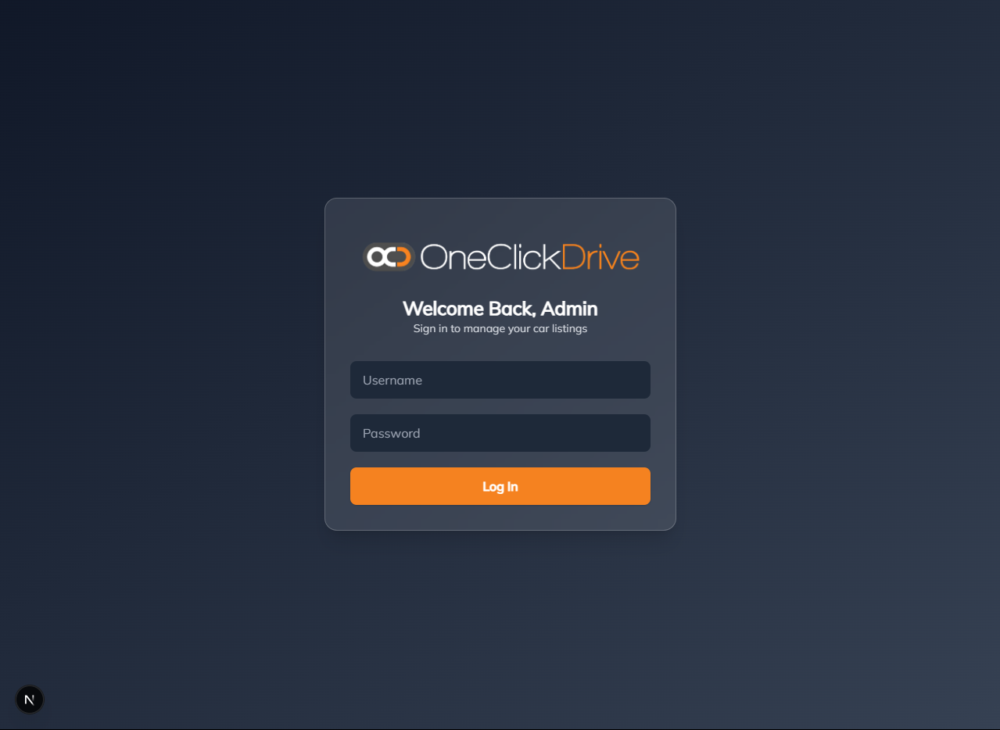
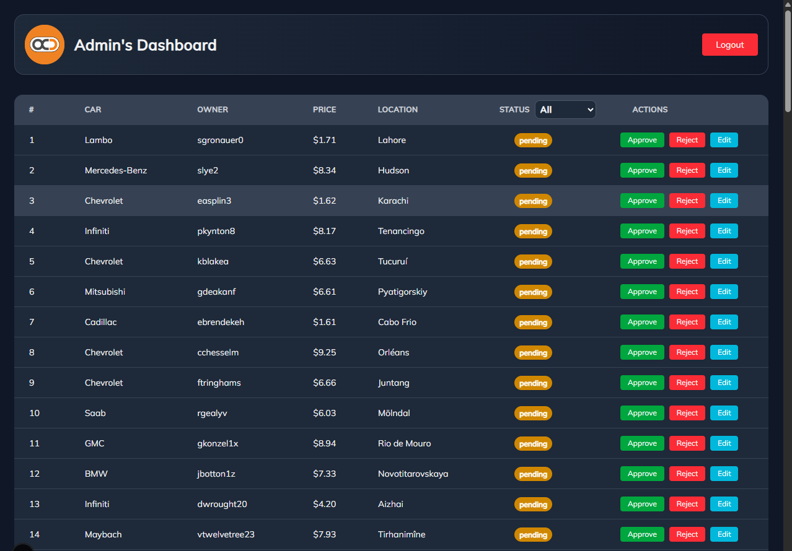
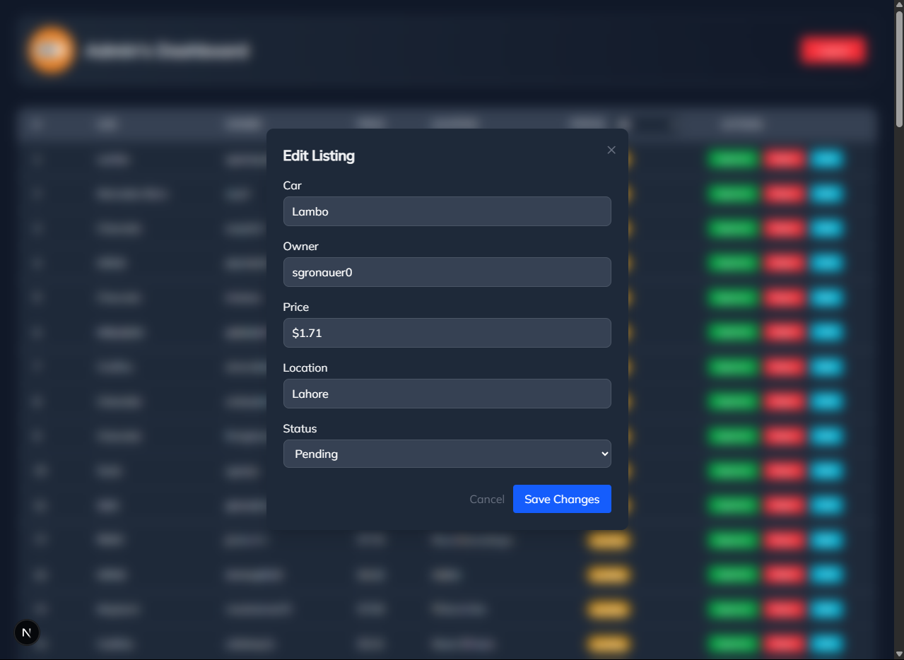

# 🚗 Admin Dashboard – Car Rental Listings (Next.js Developer Assessment)

This is a **custom-built admin dashboard** created as part of the **Frontend Developer (Next.js)** coding assessment. The dashboard allows administrators to review, approve, reject, and edit car rental listings submitted by users.

> 📅 Submission Date: **09 July 2025**  
> 🧑‍💻 Position: Frontend Developer (Next.js)  
> ✅ No AI-generated code was used in this project. All logic and UI are implemented manually with full attention to detail.

---

## 📸 Preview Image





---

## 🔐 Admin Login (Mock Auth)

```txt
Username: admin  
Password: admin123
```
---

## ✨ Features Implemented

> ✅ Login page with basic localStorage-based authentication

> ✅ Protected dashboard route (redirects if not logged in)

> ✅ Paginated car listing table showing all submissions

> ✅ Approve / Reject listings using buttons

> ✅ Edit modal with pre-filled form to update listing details

> ✅ Framer Motion animations for smooth UI interactions

> ✅ Toast notifications for real-time feedback

> ✅ SQLite database integration for persistent storage

> ✅ Next.js API routes to handle listing updates

---

## 💡 Stretch Features (Partially Covered)

> ✅ Filter by listing status

---

## 🛠️ Tech Stack
> Next.js (App Router + API Routes)
> React with Framer Motion
> Tailwind CSS
> SQLite (via better-sqlite3)
> React Toastify
> Manual State Management (useState, useEffect)

---

## 🚀 Getting Started

### 1. Clone this repo

```bash
git clone https://github.com/your-username/nextjs-admin-dashboard
cd nextjs-admin-dashboard
```

### 2. Install dependencies

```bash
npm install
```

### 3. Seed the database

```bash
node scripts/seed.js
```

### 4. Run the project locally

```bash
npm run dev
```

---

## ⚙️ How It Works
> Listings are stored in SQLite and fetched via Next.js API routes
> getServerSideProps is used to SSR the dashboard data
> Login session is saved in localStorage
> Admin actions (Approve/Reject/Edit) update listings via PUT requests
> UI powered by Tailwind CSS and Framer Motion

---

## 🧾 License
> This project is created only for assessment purposes.
> No code generators, AI tools, or Copilot were used.
> All code is original and written manually by the developer.

---

## 🙋‍♂️ Author
Muhammad Zain Alam
Frontend Developer | React.js & Next.js Enthusiast
📧 muhamadzainalam.dev@gmail.com
